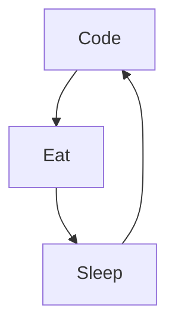

### Hi there 👋

### &#11088; GitHub Stats ~ 

### :zap: Recent Activity

<!--START_SECTION:activity-->
1. 🎉 Merged PR [#131](https://github.com/madlabsinc/teachcode/pull/131) in [madlabsinc/teachcode](https://github.com/madlabsinc/teachcode)
2. 🎉 Merged PR [#132](https://github.com/madlabsinc/teachcode/pull/132) in [madlabsinc/teachcode](https://github.com/madlabsinc/teachcode)
3. 🎉 Merged PR [#133](https://github.com/madlabsinc/teachcode/pull/133) in [madlabsinc/teachcode](https://github.com/madlabsinc/teachcode)
4. 🎉 Merged PR [#134](https://github.com/madlabsinc/teachcode/pull/134) in [madlabsinc/teachcode](https://github.com/madlabsinc/teachcode)
5. 🎉 Merged PR [#35](https://github.com/jamesgeorge007/csstox/pull/35) in [jamesgeorge007/csstox](https://github.com/jamesgeorge007/csstox)
<!--END_SECTION:activity-->

Here are some ideas to get you started:

- 🔭 I’m currently working on ...
- 🌱 I’m currently learning  :       
- 👯 I’m looking to collaborate on ...
- 🤔 I’m looking for help with ...
- 💬 Ask me about ...
- 📫 How to reach me: ...
- 😄 Pronouns: ...
- ⚡ Fun fact: ...
-->

### My Daily Routine :

