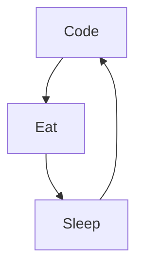

### Hi there 👋

### &#11088; GitHub Stats ~ 

Here are some ideas to get you started:

- 🔭 I’m currently working on ...
- 🌱 I’m currently learning  :       
- 👯 I’m looking to collaborate on ...
- 🤔 I’m looking for help with ...
- 💬 Ask me about ...
- 📫 How to reach me: ...
- 😄 Pronouns: ...
- ⚡ Fun fact: ...
-->

### My Daily Routine :

